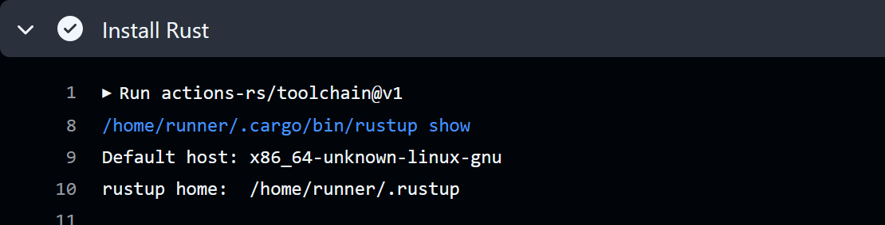
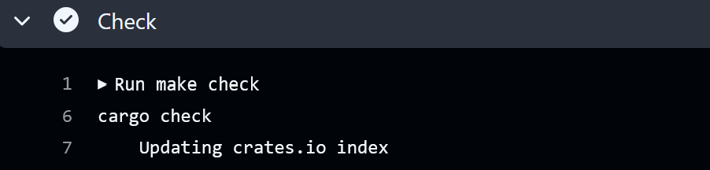
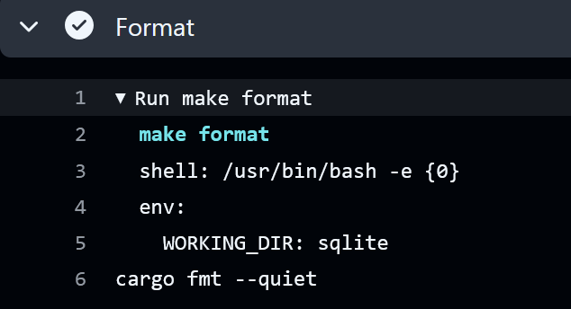
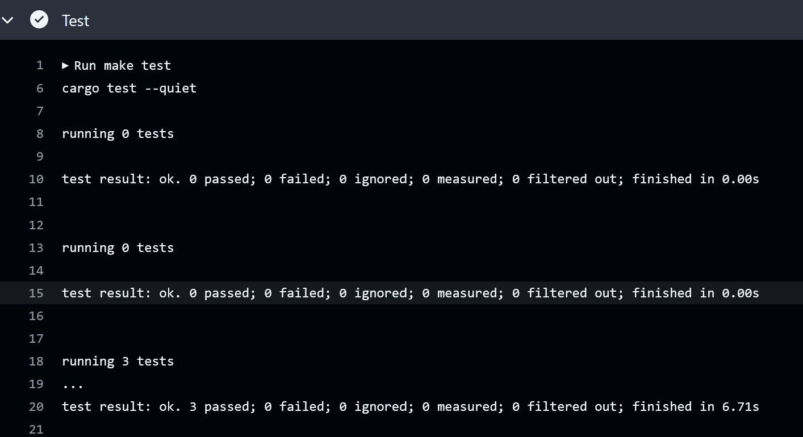
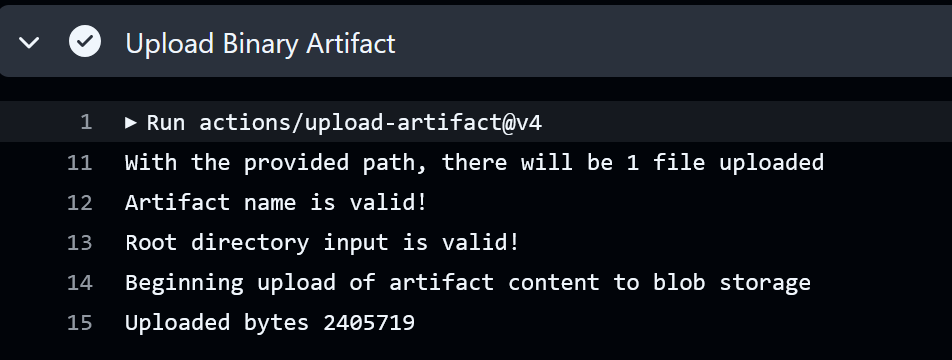

# Rust SQLite Project 

The purpose of this project is to perform ETL (extract, transform, load) with Rust and a SQLite database and perform CRUD operations in SQL with the data. The  is imported as a csv and loaded in as nfl_Receivers.db; it contains 1932-2013 career stats for NFL receivers.  

## Functionality and commands:
* ETL - extracts data from url, transforms data for analysis, and loads data into SQLite database (lib.rs) 
* nfl_Receivers.db
* Perform CRUD operations: create, read, update, and deletes data in table, this can be done via the command line. 
* tests.rs - test script
* CI/CD pipeline (github actions)
* Rust binary artifact
* Cargo.toml - dependencies and requirements
* Makefile
* Dockerfile and devcontainer
* query_log.md to see sample queries

## ETL Pipeline Overview

## Preparation and Usage
1. Open codespaces 
2. Load repo to code spaces
3. Wait for installation of Rust and Cargo 

4. Run `cargo build` to install dependencies
5. Extract: `cargo run extract` or `make extract`
6. Transform and Lad: `cargo run transform_load` or `make transform_load`
7. CRUD operations: `make create`, `make read`, `make update`, `make delete`
8. To query: `cargo run query <query>` - insert whatever SQL query 

## Compile, format, and test errors
* Run `make check`

* Run `make format`

* Run `make test` 

* Run `make release`

To genearte an optimized binary in target/release/<projectname> directory

## Binary Artifact

Binary can be accessed and downloaded by going to `Actions` -> Select the most recent workflow -> Scroll down to `Artifacts` to download

## Use of LLMS
I used ChatGPT to help me convert my Python code to Rust. Additionally, I ran into issues with my binary artifact and used ChatGPT to help me figure out my issue (it was setting my working directory path to the correct folder). In general, when I ran into issues with compiling, I used ChatGPT to help point me in the correct direction to fix syntax and dependency errors. 

## Demo 

